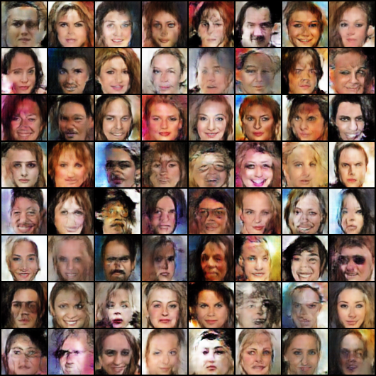
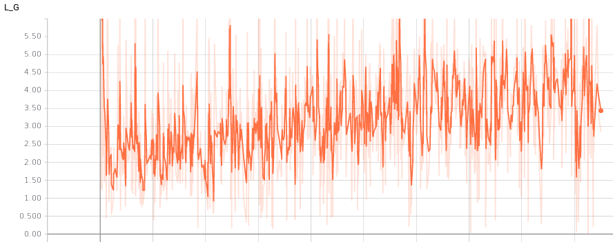

# Pytorch_GAN_CelebA
Pytorch implementation of DCGAN, CDCGAN, LSGAN, WGAN and WGAN-GP for CelebA dataset.

## Usage
### 1. Download the [CelebA](http://mmlab.ie.cuhk.edu.hk/projects/CelebA.html) dataset, and aligned version is used in this repo.
### 2. Clone the repo
```bash
$ git clone https://github.com/AndrewZhuZJU/Pytorch_GAN_CelebA.git
$ cd Pytorch_GAN_CelebA
```
### 3. Training
To train any GAN please use `main_**.py`. For example, 
```bash
$ python main_DCGAN.py
```
Not that all the setting parameters for the modesl are in `args.py`, please change properly.

## Results
### Animation of generated images with fixed noise (or condition labels) during training progress

<table align='center'>
	<tr align='center'>
		<td> DCGAN </td>
		<td> LSGAN </td>
		<td> CGAN(Up:Male, Bottom:Female) </td>
	</tr>
	<tr align='center'>
		<td></td>
		<td></td>
		<td></td>
	</tr>
	<tr align='center'>
		<td> WGAN </td>
		<td> WGAN-GP </td>
	</tr>
	<tr align='center'>
		<td></td>
		<td></td>
	</tr>
</table>

### Generated images in Epoch 40
<table align='center'>
	<tr align=center>
		<td> DCGAN </td>
		<td> LSGAN </td>
		<td> CGAN(Up:Male, Bottom:Female) </td>
	</tr>
	<tr align='center'>
		<td></td>
		<td></td>
		<td></td>
	</tr>
	<tr align=center>
		<td> WGAN </td>
		<td> WGAN-GP </td>
	</tr>
	<tr align='center'>
		<td></td>
		<td></td>
	</tr>
</table>

## Loss Plot
Take DCGAN  for example:
<table align='center'>
	<tr align=center>
		<td> Generator Loss </td>
		<td> Discriminator Loss </td>
	</tr>
	<tr align='center'>
		<td></td>
		<td></td>
	</tr>
</table>

## Evaluation
* Inception score calculated in Epoch 40 (30K generated images)
<table align='center'>
	<tr align=center>
		<td> DCGAN </td>
		<td> LSGAN </td>
		<td> WGAN </td>
		<td> WGAN-GP </td>
	</tr>
	<tr align='center'>
		<td>2.10 \pm 0.04</td>
		<td>2.08 \pm 0.02</td>
		<td>2.20 \pm 0.02</td>
		<td>1.97 \pm 0.02</td>
	</tr>
</table>

* Inception score calculated in Epoch 20 (30K generated images)
<table align='center'>
	<tr align=center>
		<td> DCGAN </td>
		<td> LSGAN </td>
		<td> WGAN </td>
		<td> WGAN-GP </td>
	</tr>
	<tr align='center'>
		<td> 2.07 \pm 0.03</td>
		<td> 1.95 \pm 0.03</td>
		<td> 2.05 \pm 0.02</td>
		<td> 2.00 \pm 0.02</td>
	</tr>
</table>

## Development Environment
* Ubuntu 16.04 LTS
* NVIDIA GTX 1080 Ti
* CUDA 9.0
* pytorch 0.4
* python 2.7
* Others Dependencies: numpy, imageio, torchvision, tensorboard, etc.

## References
[1.Unsupervised Representation Learning with Deep Convolutional Generative Adversarial Networks](https://arxiv.org/abs/1511.06434)

[2.Conditional Generative Adversarial Nets](https://arxiv.org/abs/1411.1784)

[3.Wasserstein GAN](https://arxiv.org/abs/1701.07875) 

[4.Improved Training of Wasserstein GANs](https://arxiv.org/abs/1704.00028) 

[5.Least Squares Generative Adversarial Networks](https://arxiv.org/abs/1611.04076)
